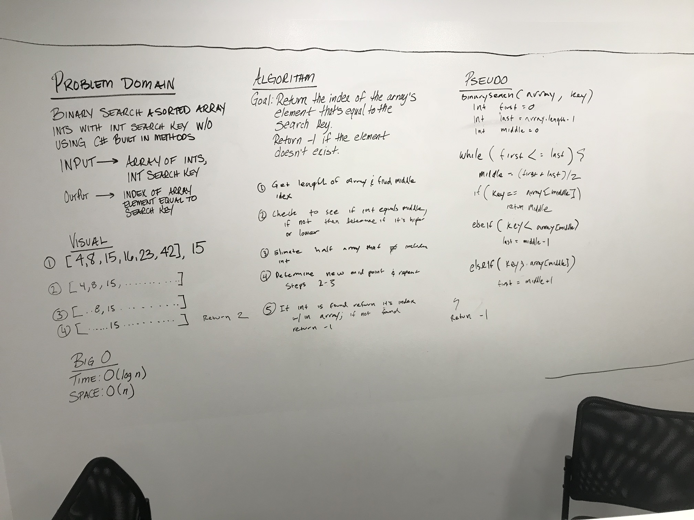

# Binary Search Sorted Array

## Challenge
Write a function called BinarySearch which takes in 2 parameters: a sorted array and the search key. Without utilizing any of the built-in methods available to your language, return the index of the array’s element that is equal to the search key, or -1 if the element does not exist. 

## Approach & Efficiency

1. Big O Time = O(n) // Big O Space = O(n)
	- The time of this algorithm is O(n) and and the space is O(log n).  

## Solution

