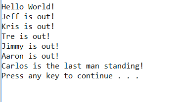

# Eeney Meeney Miney Moe
A console application for the children's game Eeney Meeney Miney Moe

## Challenge
Write a function called `EeneyMeeneyMineyMoe()` that accepts a list of strings and an int `n`. Start at the beginning of the list and count up to `n` and remove the person at the current index from the list. Keep counting from that index and count up to `n` over and over until only one person is left in the list. Return a string with the name of the last person left in the list.

## Approach and Efficiency
Built using custom Queue
### Big O:
- Time: O(n) Loop through entire queue.

- Space: O(n) Make new Queue from Array

## Visual 

