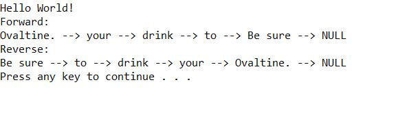

# Reverse A Linked List

## Challenge
Reverse a Linked List in O(1) space

## Approach & Efficiency

1. Big O Time = O(n)
	- Traverse Linked List once

2. Big O Space = O(1)
	- Reassign pointers without creating new list

## Solution Output

